# Proyecto2-Hipotesis
# Contexto: 
Una discográfica se enfrenta al emocionante desafío de lanzar un nuevo artista en el escenario musical global.
# Objetivo:
Explorar un conjunto de datos con el fin de identificar patrones o características que puedan determinar los factores que contribuyen al éxito de una canción teniendo como herramienta 
un extenso dataset de Spotify con información sobre las canciones más escuchadas en 2023.
Las respuestas obtenidas nos ayudarán a realizar la validación de las siguientes hipótesis:

1.Las canciones con un mayor BPM (Beats Por Minuto) tienen más éxito en términos de cantidad de streams en Spotify.

2.Las canciones más populares en el ranking de Spotify también tienen un comportamiento similar en otras plataformas como Deezer.

3.La presencia de una canción en un mayor número de playlists se relaciona con un mayor número de streams.

4.Los artistas con un mayor número de canciones en Spotify tienen más streams.

5.Las características de la canción influyen en el éxito en términos de cantidad de streams en Spotify.

# Equipo:
Trabajo realizado de forma grupal.
Elizabeth Takury y Natalia Alejandro. 

# Herramientas y Tecnologías:
# 1.Herramientas:
* Google Sheets
* BigQuery
* Power BI
* ChatGPT 
* Google Slides 
* Loom
# 2.Lenguajes:
* Lenguaje SQL en BigQuery.
 
# Descripción de las variables del dataset
# Trackinspotify
- track_id: Identificador único de la canción. Es un número entero de 7 dígitos que no se repite

- track_name: Nombre de la canción

- artist(s)_name: Nombre del artista(s) de la canción

- artist_count: Número de artistas que contribuyen a la canción.

- released_year: Año en que se lanzó la canción.

- released_month: Mes en el que se lanzó la canción.

- released_day: Día del mes en que se lanzó la canción.

- inspotifyplaylists: Número de listas de reproducción de Spotify en las que está incluida la canción

- inspotifycharts: Presencia y ranking de la canción en las listas de Spotify

- streams: Número total de transmisiones en Spotify. Representa la cantidad de veces que la canción fue escuchada.
# Trackincompetition

- track_id: Identificador único de la canción. Es un número entero de 7 dígitos que no se repite

- inappleplaylists: número de listas de reproducción de Apple Music en las que está incluida la canción

- inapplecharts: Presencia y rango de la canción en las listas de Apple Music

- indeezerplaylists: Número de listas de reproducción de Deezer en las que está incluida la canción

- indeezercharts: Presencia y rango de la canción en las listas de Deezer

- inshazamcharts: Presencia y rango de la canción en las listas de Shazam
# Tracktechnicalinfo
- track_id: Identificador único de la canción. Es un número entero de 7 dígitos que no se repite

- bpm: Pulsaciones por minuto, una medida del tiempo de la canción.

- key: Clave musical de la canción

- mode: Modo de la canción (mayor o menor)

- danceability_%: Porcentaje que indica qué tan adecuada es la canción para bailar

- valence_: Positividad del contenido musical de la canción.

- energy_: Nivel de energía percibido de la canción.

- acusticness_: Cantidad de sonido acústico en la canción.

- instrumentality_: Cantidad de contenido instrumental en la canción.

- liveness_: Presencia de elementos de actuación en vivo.

- speechiness_: Cantidad de palabras habladas en la canción.
# Procesamiento y preparación de datos:

Previo al análisis, importamos el dataset a un nuevo proyecto en BigQuery para proceder con la depuración de los datos. 

* Se identificó valores nulos y valores duplicados, además de carácteres raros.

* No se tomaron en cuenta los siguientes id: '5080031', '3814670', '8173823', '1119309', '0:00'.

* Se identificaron que las variables key y mode dentro de la tabla de technical info no son útiles dentro del análisis. 

* Se identifivó y modificó la variable streams la cual estaba en formato texto a formato número. 

* Se realizó un consolidado junto con las nuevas variables usando LEFT JOIN y la vista (view) con los datos limpios de cada tabla.

* Se crearon nuevas variables:

1. fecha_released: concatenando día, mes y año. 

2. total_playlist: sumando in_spotify_playlists e in_spotify_charts.

3. season: estaciones del año.

4. Cuartiles y categoría: Se asignó según la segmentación de cuartiles la categoría "alto" y "bajo" a cada característica de canción de la tabla technical info de la siguiente forma:

# Visualización y análisis de datos
* Importamos datos desde BigQuery hacia PowerBi.

* Se realizó ténicas de agrupación según variables categóricas, obteniendo la cantidad de canciones por artista y por año de lanzamiento. Obtenemos la siguiente tabla:

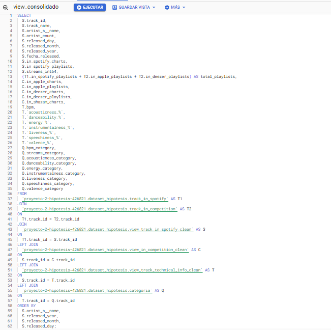

* Se aplicó medidas de tendencia central con la ayuda del lenguaje de Python para visualizar distribución a través de un histograma:

  * Histograma BPM:
  Muestra la distribución de BPM en el conjunto de datos. Los BPM varían entre 75 y 200, con una mayor concentración en los rangos más bajos. Esto sugiere que las canciones con BPM más lentos son más comunes en el conjunto de datos.

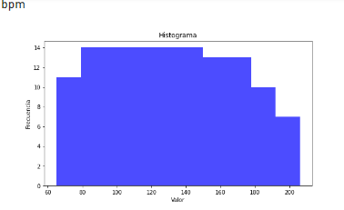

 * Histograma Streams:
 Muestra la frecuencia en la cantidad de veces que una canción fue escuchada. En su mayoría están concentradas en el primer intervalo (lado izquierdo) esto sugiere que 
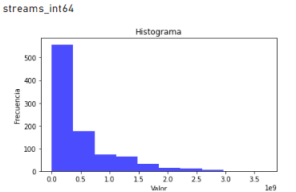

# -Presentación de resultados.
# Resultados: 
Validación de hipótesis 
# * Hipótesis 1: 
Las canciones con un mayor BPM (Beats Por Minuto) tienen más éxito en términos de cantidad de streams en Spotify 

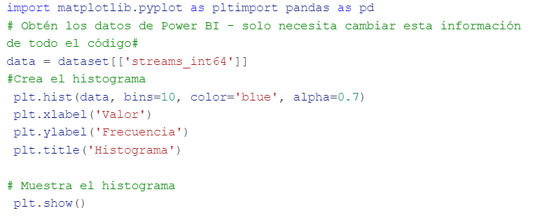

Respuesta: Se rechaza la hipótesis de que las canciones con un mayor BPM tienen más éxito en términos de cantidad de streams en Spotify, ya que el valor de la correlación obtenido (-0.002336203586) indica que no existe una relación significativa entre estas variables.

# Hipótesis 2: 
Las canciones más populares en el ranking de Spotify también tienen un comportamiento similar en otras plataformas como Deezer.

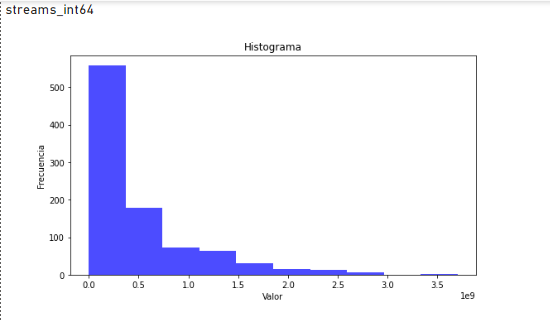
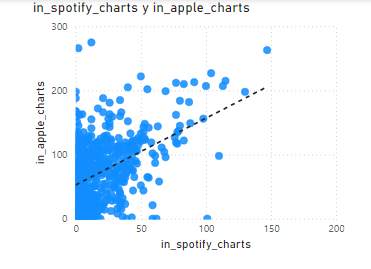
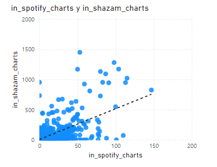

Respuesta:  La hipótesis es aceptada, porque los valores de las correlaciones, que son 0.5999860553480 para Deezer, 0.5515564831921 para Apple Music, y 0.605488541573 para Shazam, indican una relación moderada a fuerte, lo que sugiere que las canciones populares en Spotify tienden a ser populares también en estas otras plataformas.

# Hipótesis 3: 
La presencia de una canción en un mayor número de playlists se relaciona con un mayor número de streams.

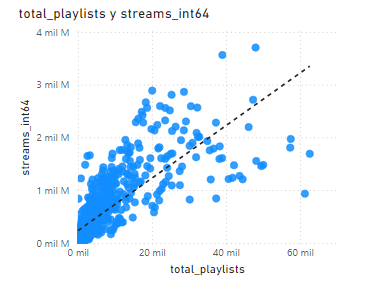

Respuesta: El valor de la correlación obtenido (0.783568569951) indica una relación fuerte y positiva, sugiriendo que las canciones que aparecen en más playlists tienden a tener más streams.

# Hipótesis 4: 
Los artistas con un mayor número de canciones en Spotify tienen más streams.

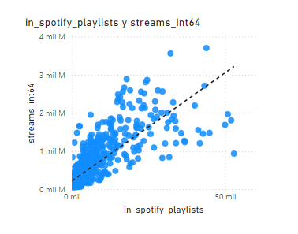

Respuesta: Dado que el valor de la correlación es alto (0.77892616317456), podemos concluir que existe una relación fuerte y positiva entre el número de canciones que un artista tiene en Spotify y la cantidad total de streams que recibe. Esto sugiere que los artistas con más canciones tienden a tener más streams.

# Hipótesis 5: 
Las características de la canción influyen en el éxito en términos de cantidad de streams en Spotify.

 * Correlación streams vs danceability: -0.105501164099

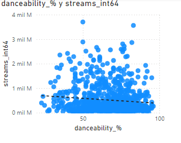

 * Correlación streams con valency: -0.041370563742

 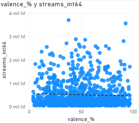

 * Correlación streams con acousticness: -0.0052737047472

 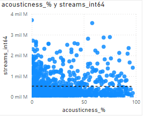

 * Correlación streams con energy: -0.025626822823

 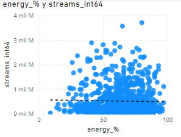

 * Correlación streams con instrumentalnes: -0.04423444890059

 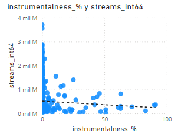

 * Correlación streams con liveness: -0.049480680490

 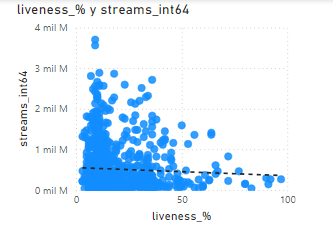

 * Correlacióntreams con speechiness: -0.112763169712

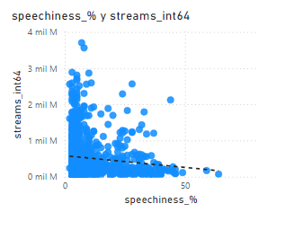

Respuesta: Los valores de las correlaciones obtenidos son todos negativos y muy bajos, lo cual indica que no existe una relación significativa entre estas características de las canciones y su éxito en términos de cantidad de streams en Spotify. Ninguna de las características evaluadas parece tener un impacto considerable en el número de streams.

# Conclusiones:

* Popularidad en Múltiples Plataformas: Las canciones que son populares en Spotify tienden a ser populares en otras plataformas como Deezer, Apple Music y Shazam. Esto sugiere que una estrategia de promoción que abarque múltiples plataformas puede ser efectiva para aumentar el éxito de una canción.

* La presencia de una canción en un mayor número de playlists tiene una relación fuerte y positiva con la cantidad de streams. Esto indica que una estrategia de inclusión en playlists, tanto oficiales como de usuarios, es crucial para aumentar los streams.

* Los artistas con un mayor número de canciones en Spotify tienden a tener más streams en total. Esto sugiere que una mayor producción y publicación de contenido puede contribuir al éxito en términos de streams.

# Enlaces de interés:

